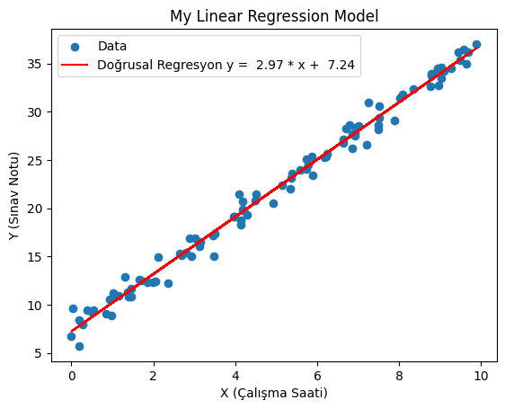

# Simple Linear Regression from Scratch (No scikit-learn)

This project demonstrates how to build and visualize a simple linear regression model from scratch using only NumPy and Matplotlib — **no external machine learning libraries like scikit-learn are used**.

## 📊 Problem Description

We aim to predict a student's exam score based on the number of hours they studied.  
The data is generated synthetically as:

```
y = 3 * x + 7 + noise
```

Where:
- `x` is the number of study hours (0–10)
- `noise` is small random Gaussian noise

---

## 🧮 Model Logic

The linear regression model is defined as:

```
y = m * x + b
```

Where:
- `m` is the slope (how much `y` increases as `x` increases)
- `b` is the y-intercept (the value of `y` when `x = 0`)

We calculate these values using the **least squares method**.

---

## 🧠 Functions

### `linear_regression(X, y)`
Calculates the slope `m` and intercept `b` using the formulas:

```python
m = Σ((x - x̄) * (y - ȳ)) / Σ((x - x̄)²)
b = ȳ - m * x̄
```

---

### `predict(x, m, b)`
Returns predicted `y` values for given `x` values using the regression equation.

---

### `mean_squared_error(y_true, y_pred)`
Calculates the Mean Squared Error (MSE), a common evaluation metric:

```python
MSE = mean((y_true - y_pred)²)
```

---

## 📈 Visualization

The data points and the fitted regression line are plotted using Matplotlib:

- **Blue dots** represent actual data
- **Red line** shows the regression prediction



---

## 📌 Output Example

```bash
Slope (m): 2.95
Intercept (b): 7.18
Mean Squared Error: 0.96
```

---

## 🛠️ Requirements

- Python 3.x
- NumPy
- Matplotlib

Install requirements (if needed):

```bash
pip install numpy matplotlib
```

---

## ✅ Summary

This project is a basic example of how linear regression works under the hood — great for beginners learning the core concepts of machine learning and statistics.

Feel free to fork this repo, experiment with your own datasets, and extend it into multivariate regression or even gradient descent-based training.
